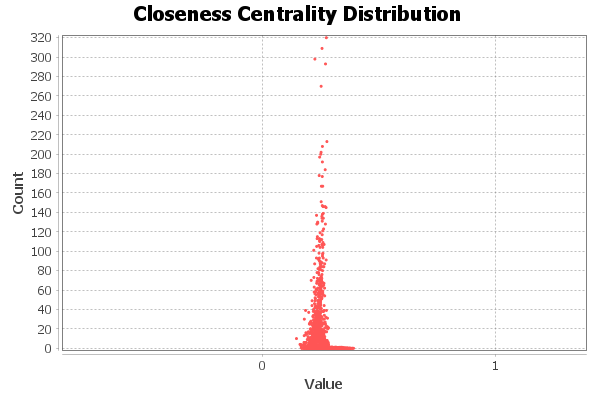
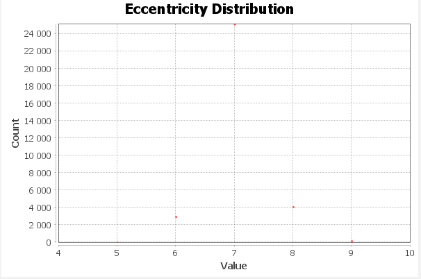
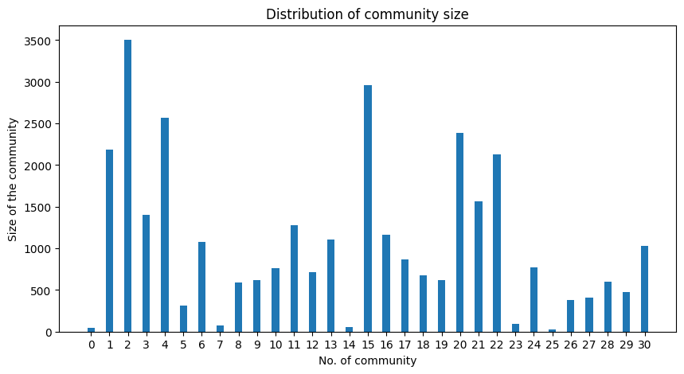
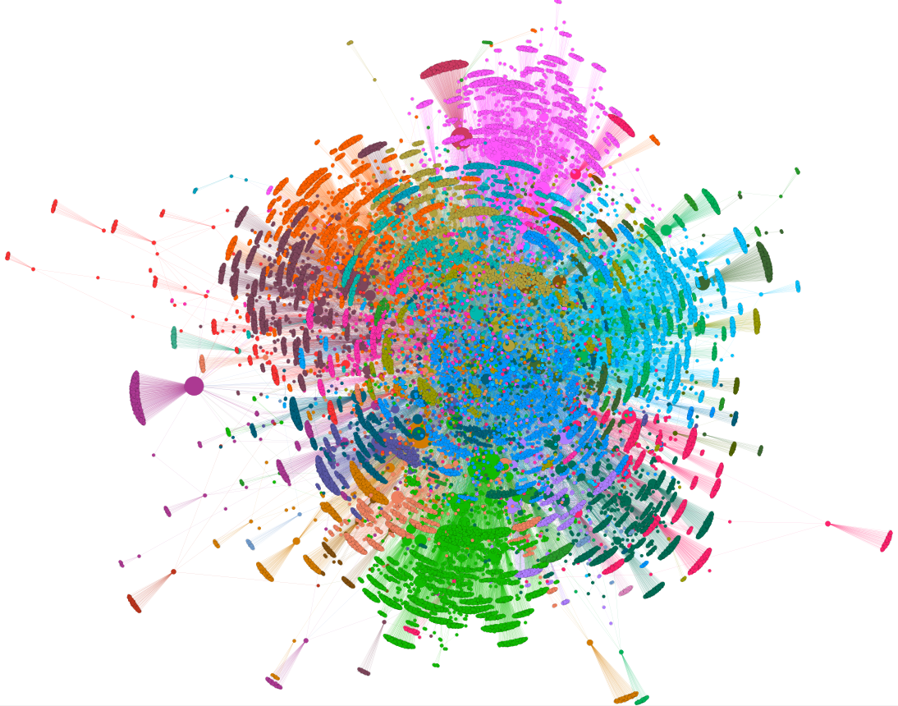
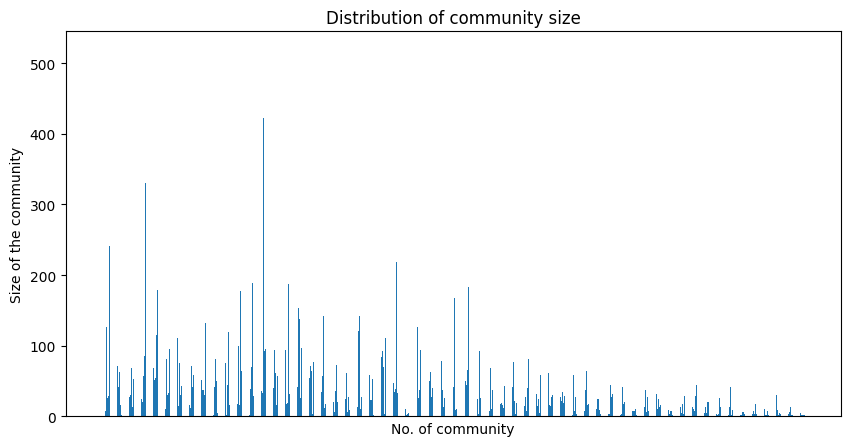
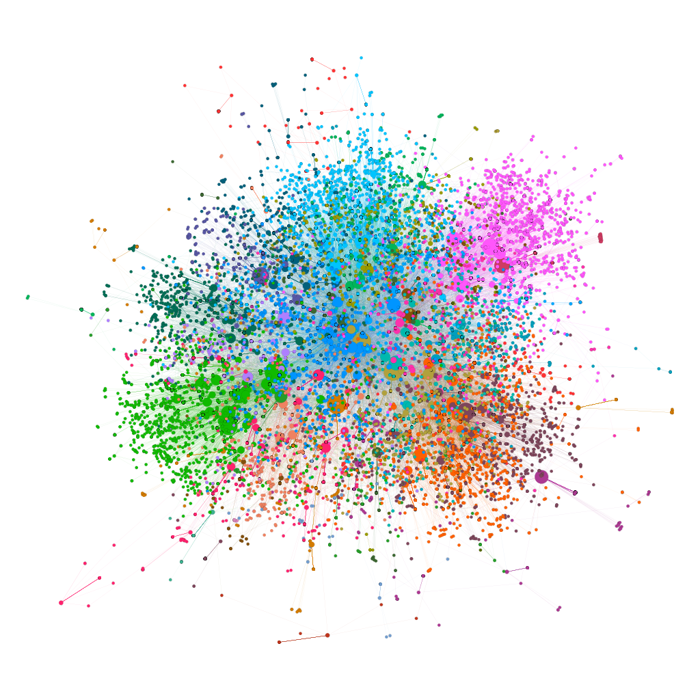

<\>

# **Report analýzy sítě emailové komunikace**
*Ondřej Javorský (JAV0032)* \
*19.1.2023*

---

<i>zdroj </i><a href="https://networkrepository.com/ia-email-EU.php">NetworkRepository</a>

## **Popis datového souboru**

Data použitá pro report ve formě grafové sítě pocházejí z Evropské výzkumné instituce a jsou volně k dispozici (viz zdroj).

Vrcholy reprezentují jedinečné emailové adresy uživatelů zasílajících emailové zprávy. Hrany poté výměnu těchto zpráv mezi dvěma uživately navzájem, jelikož je graf neorientovaný.

## **Analýza lokálních a globálních vlastností**

Pro lokální a globální analýzu byl použit vizualizační software Gephi (viz zdroj)

| Počet vrcholů | Počet hran | Hustota   |  Průměr | Průměrný stupeň | Maximální stupeň | 
| ------------- | ---------- | --------- | ------- | --------------- | ---------------- |
| 32430         | 54397      | 0.0001034 |  9      | 3,355           | 623              |

**Distribuce stupňů jednotlivých vrcholů**

<DOPLNIT!!>

##### Centrality založené na cestách mezi vrcholy

Výsput z Gephi pro `closeness centrality`

Výstup z Gephi pro `ecentricity centrality`

#####  Průměrný zhlukovací koeficient

Pro analyzovaný graf je hodnota rovna **0.1127**

**Graf pro shlukovací efekt**

Graf reprezentující četnosti zhlukovaacího koeficientu vůči jednotlivým skupinám vrcholů se stejným stupňem.

<i>zdroj </i><a href="https://networkx.org/documentation/stable/reference/algorithms/community.html">NetworkX community detection</a>

## **Analýza komunitní struktury**

Pro detekci komunit byla použita knihovna NetworkX v jazyce Python (viz zdroj). \
Jelikož se jedná o obsáhlý graf s mnoha vrcholy, využijí se algorritmy k tomu vhodné.

##### Metoda zhora dolů

> Výsledek algoritmu Louvain Method (`louvain_communities`)

Tento algoritmus je založený na detekci komunit na základě modularity. Výsledné pořadí komunit je poté závislé na parametru seed, následujou tedy tři příklady pro různé seedy.

| Náhodný seed | Počet komunit | Průměr  | Min. počet | Max. počet |                   Modularita|
| ------------ | ------------- | ------- | ---------- | ---------- | ----------------------------|
| 100          | 31            | 1046.13 | 29         | 3504       |                   **0.7191**|
| 0            | 29            | 1118.27 | 56         | 3500       |                   0.7183    |
| 777          | 33            | 982.72  | 29         | 4017       |                   0.7178    |
Pro další postup budeme brát rozdělení s největší modularitou, tedy se seedem 100.

**Sloupcový graf reprezentující distribuci velikostí komunit**

**Vizualizace grafu ke kontextu vybranných komunit**

##### Metoda zdola nahoru

> Výsledek algoritmu Label Propagation Algorithm  (`label_propagation_communities`)

Způsob nalezení komunit je založen na postupného šíření příznaku (štítku), kdy vrcholy v stejné komunitě mají stejný příznak. \
Algoritmus je také jeden z efektivně výpočetních pro aplikaci na velké grafy.

| Počet komunit | Průměr | Min. počet | Max. počet | Modularita |
| ------------- | ------ | ---------- | ---------- | ---------- |
| 764           | 42.448 | 2          | 519        | 0.581      |    

Zde je vidět, že sice tento algoritmus je rychlejší, ale výsledná modularita je menší než u algoritmu předchozího. O čem svědčí také vysoký počet komunit.

**Sloupcový graf reprezentující distribuci velikostí komunit**

*Kvůi velikému počtu komunit jsou schovány x-ové souřadnice, aby byl graf čitelný*

**Vizualizace grafu ke kontextu vybranných komunit**

Na vizualizaci jde vidět menší modularita než u vizualizace předchozí, kdy byly použity stejné layout algoritmy v Gephi.
